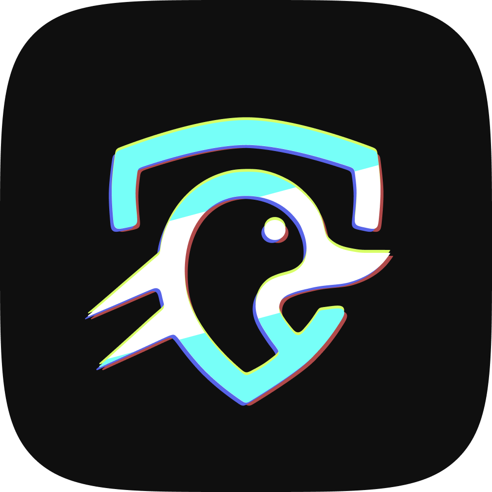
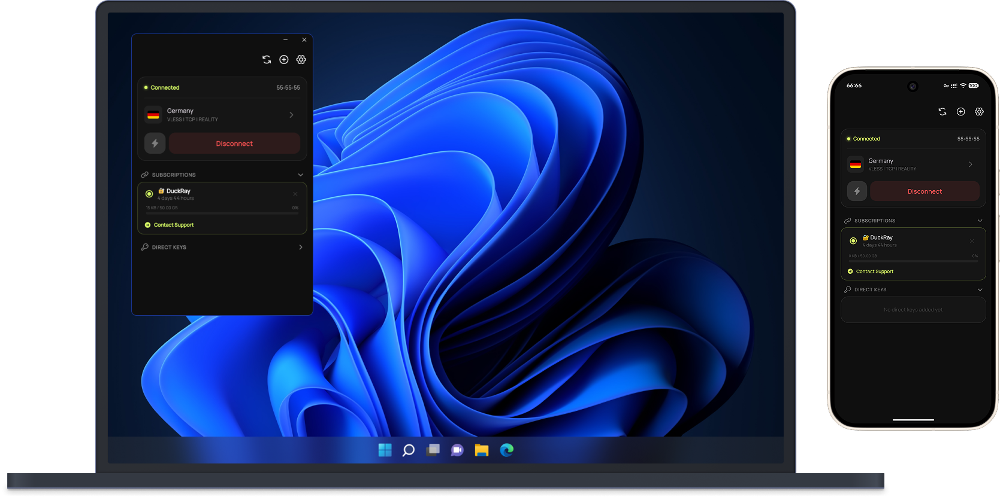

  

# DuckRay - Proxy Client
**DuckRay** is a fast, cross-platform client for managing custom proxy and VPN connections, built on top of the powerful [Xray-core](https://github.com/XTLS/Xray-core). DuckRay provides an intuitive interface to easily add, switch, and manage your subscriptions and connection keys.

  

### 🌟 Main Features

- Cross-platform support: Android, Windows, macOS (coming soon).
- Intuitive and user-friendly interface - designed for easy access and smooth navigation.
- Automatic fastest server selection - connects to the lowest-latency node instantly.
- Broad protocol compatibility: VLESS, VMess, Reality, Shadowsocks, Trojan.
- Flexible subscription & config support: Sing-box, V2Ray formats.
- Automatic subscription updates - keeps your profiles fresh without manual effort.
- Detailed profile stats: displays remaining validity (days) and traffic usage.
- Dark and light themes - choose the mode that suits you best.
- Universal compatibility - works seamlessly with all major proxy management panels.

### 📥 Direct Download
- **[Android](https://github.com/duckray-client/DuckRay/releases/latest/download/DuckRay.apk)**
- **[Windows](https://github.com/duckray-client/DuckRay/releases/latest/download/DuckRay_Setup.exe)**
- **macOS (coming soon)**

# Acknowledgements
Special thanks to the creators and maintainers of the following projects. Their robust tools and innovations greatly empowered the development of this app.
- **[Xray-core](https://github.com/XTLS/Xray-core)**
- **[AndroidLibXrayLite](https://github.com/2dust/AndroidLibXrayLite)**
